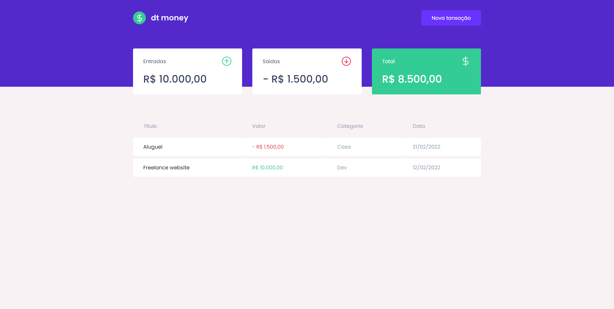
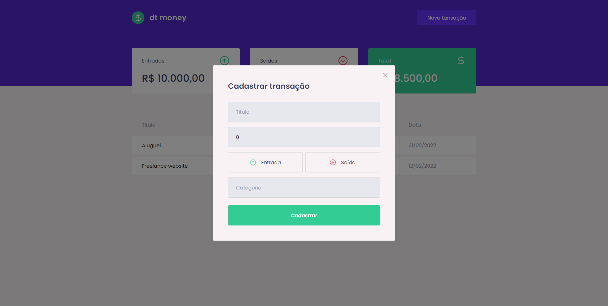
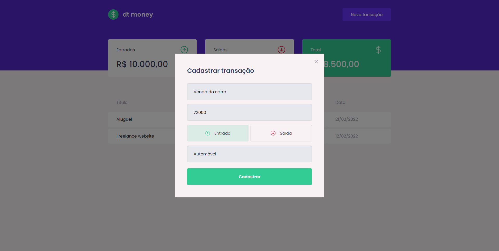
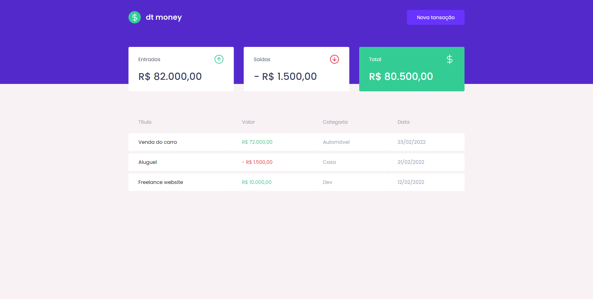

<p align="center">
   
</p>

---

<br/>

<p align="left">
  <a href="https://www.linkedin.com/in/murilosambuite/"> 
    
  </a>
</p>

<br />

> App developed at [Rocketseat Ignite](https://www.rocketseat.com.br/ignite).

<br />

## :camera: Demo

<p align="center">
  
</p>

<p align="center">
  
</p>

<p align="center">
  
</p>

<p align="center">
  
</p>

<br />

## :hammer: Tools/Technologies

<em>This front-end features the latest tools and practices in web development!</em>

- **React** — A library to build user interfaces
- **Axios** — API requests
- **Miragejs** — API mocking library
- **Polished** — A toolset for writing styles in JS
- **Styled-components** — CSS-in-JS library
- **React-modal** — React own library to create modal

<br />

## :computer: Installation

### Step by step to run the application on your machine:

Clone this repository:

```
  git clone https://github.com/sambuite/dtmoney.git

  cd dtmoney
```

Run the following scripts
(You will need npm or yarn installed) :

```
  // Install the dependencies
  npm install

  // Start the application
  npm start
```

or if you use yarn

```
  // Install the dependencies
  yarn

  // Start the application
  yarn start
```
